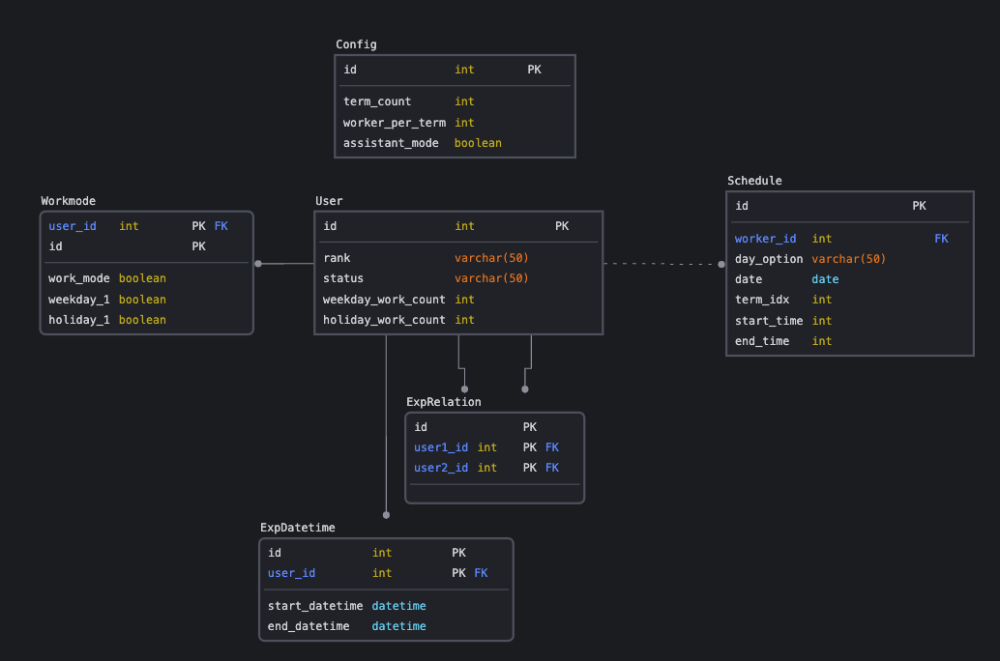
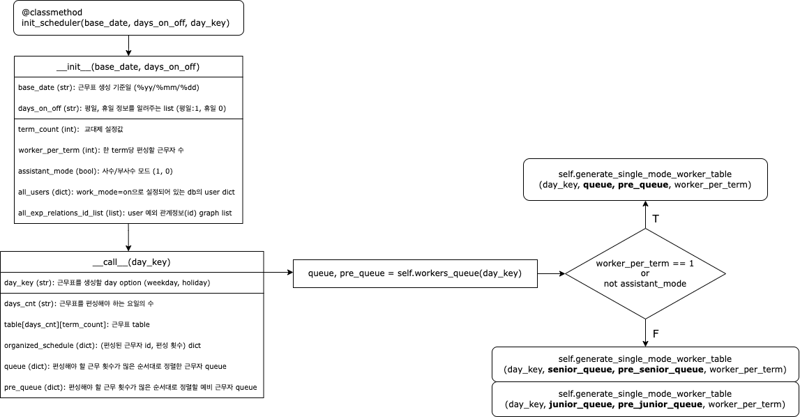

# 🪖 Auto Work-Scheduler Generator 🪖

PyQt 기반의 근무 공정표 자동 생성기 GUI 프로그램입니다.  
이 프로그램은 대한민국 육군의 교대근무 편성 요소들을 고려하여 제작되었습니다.
<br /><br />

## 0. 개요

### Domain
로직을 도메인 단위로 분리하여 관리한다.   
각 도메인 별로 추상클래스(`Interface`)와 구체클래스(`Repository`)를 구현한다.

  

- **`Config`**: 프로그램 설정    
- **`User`**: 사용자 정보
- **`Schedule`**: 근무 편성 결과  
- **`Workmode`**: 근무편성을 위한 사용자별 옵션
- **`Exception`**: 근무편성을 위한 예외정보

#### Interface
객체(`Entity`)에 대한 추상 클래스(`Repository`)를 정의한다.

#### Repository
추상 클래스를 상속하여 구체 클래스(`InMemoryRepository`)를 정의한다.


### Component
#### Database
데이터베이스를 생성, 연결하고 도메인별로 의존성 주입을 수행한다.
데이터베이스에 접근하기 위한 QSqlQuery 객체는 Singleton으로 관리한다.

#### Window
화면 레이아웃과 메뉴를 구성하고 비즈니스 로직을 연결한다.

#### Widget
도메인 로직을 호출하여 세부 기능들에 대한 비즈니스 로직을 구성한다.
- **`RadioButtonWidget(QWidget)`**: 근무표 생성을 위한 설정값(Config)을 관리하는 ****Widget**
- **`FileWidget(QWidget)`**: db의 데이터를 관리(등록/수정/삭제)하는 로직을 수행하는 **Widget**
- **`OptionWidget(QWidget)`**: 예외관계 및 시간 설정 로직을 수행하는 **Widget**
- **`DragTreeWidget(QTreeWidget)`**: Drag를 지원하는 **TreeWidget**
- **`DropTreeWidget(QTreeWidget)`**: Drop을 지원하는 **TreeWidget**
- **`OnOffSwitch(QCheckBox)`**: 사용자 편의성을 높이기 위해 **CheckBox**를 상속하여 구현한 **Animated Toggle Switch**
- **`DateEdit(QTimeEdit)`**: 일자(yyyy:MM:dd)를 변경하는 **TimeEdit** 편집기

#### Dialog
Firebase로 로그인/회원가입 기능을 수행하는 Dialog를 생성한다.

#### Scheduler
입력 조건에 따라 근무자 queue를 구성하고 우선순위에 따른 근무표를 편성하는 알고리즘을 구현한다.



### 디렉토리 구조
``` shell
.
├── component/
│   ├── app.py
│   ├── dialog.py
│   ├── message.py
│   ├── widget.py
│   └── window.py
├── db.py
├── domain/
│   ├── entity/
│   │   ├── config.py
│   │   ├── schedule.py
│   │   ├── user.py
│   │   └── workmode.py
│   ├── interface/
│   │   ├── config.py
│   │   ├── exception.py
│   │   ├── schedule.py
│   │   ├── user.py
│   │   └── workmode.py
│   └── repository/
│       ├── config.py
│       ├── exception.py
│       ├── schedule.py
│       ├── user.py
│       └── workmode.py
├── main.py
├── scheduler.py
└── settings.py
```
<br /><br />

## 1. 기능

| 계급 | 이름 | 상태(사수, 부사수) | 근무 여부 | 평일 | 휴일 |
|-----|-----|---------------|---------|-----|-----|
| rank | name | status      | work_mode | weekday_{i} | holiday_{i} |

- 프로그램 기본 설정
  - 시간당 근무 인원수 설정/수정
  - 근무 교대 횟수 설정/수정
  - 사수, 부사수 모드 설정/해제
  
- DB 등록, 수정 및 조회
  - 인원 DB 등록하기: Excel 파일을 업로드하여 정보를 일괄 저장
  - 인원 DB 수정하기
  
- 추가사항 입력 및 수정
  - 영외 인원 등록/수정
    - 휴가 등의 사유로 부대에 머무르지 않고 있는 인원의 이름, 열외기간을 등록할 수 있다  
      [ex] 홍길동 2021-09-20 ~ 2021-09-28 휴가
	  
  - 열외 내용 등록/수정
    - 근무 편성간 적용할 열외사항을 등록할 수 있다  
      [ex] 홍길동 2021-09-20 평일 3교대 근무 제외
	  
  - 특수 관계 등록/수정
    - 동반근무 편성을 제외하고자 하는 특수관계를 설정할 수 있다 (관리자 권한)  
      [ex] 김철수 - 홍길동
	  
<br /><br />


## 2. 실행 및 사용방법

1.  Firebase 연동을 위한 환경변수 생성
``` dotenv
# .env
apiKey={apiKey}
authDomain={authDomain}
databaseURL={databaseURL}
projectId={projectId}
storageBucket={storageBucket}
messagingSenderId={messagingSenderId}
appId={appId}
```
2. 프로그램 실행 시 생성되는 `Dialog`에서 회원가입/로그인을 수행 
3. 프로그램 설정값 수정 및 인원 정보 등록
4. 메인 윈도우에서 평일, 휴일, 근무 편성 제외일 설정 후 근무표 생성

